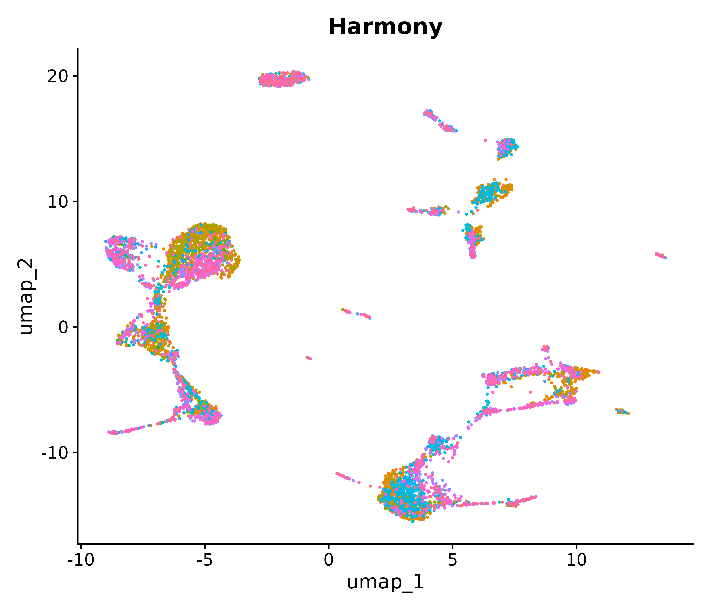
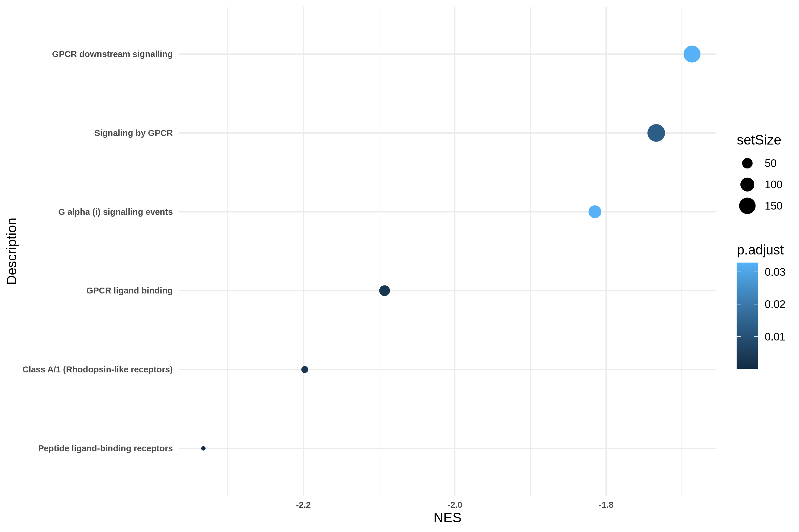

# Single-Cell Transcriptomic Analysis of Type 1 Diabetes–Associated Kidney Disease (GSE279086)

This project presents a single-cell RNA sequencing (scRNA-seq) analysis of the GSE279086 dataset to investigate cellular and transcriptional alterations in Type 1 Diabetes (T1D)–associated kidney disease. The dataset includes kidney samples from T1D patients and healthy controls, enabling comparative analysis to identify disease-associated cellular heterogeneity, gene expression changes, and pathway-level alterations.

# Study Objectives

- Characterize kidney cell populations in T1D and control samples
- Perform quality control and batch correction
- Integrate samples across conditions
- Annotate cell types using automated methods
- Identify cluster-specific marker genes
- Perform differential expression analysis (T1D vs Control)
- Conduct Reactome pathway enrichment analysis

# Dataset Information

- Accession: GSE279086
- Source: NCBI GEO
- Organism: Homo sapiens
- Tissue: Kidney
- Groups: Type 1 Diabetes (T1D) and Controls
- Data Type: Single-cell RNA sequencing

# Repository Organization

- scripts/ – Source code files used for analysis (.Rmd, ipynb and notebook scripts).
- script_runs/ – Rendered HTML reports showing executed code and results.
- plots/ – Figures generated during the analysis workflow.
- tables/ – Tabular outputs including cell proportions and marker gene results.

# Analysis Workflow

1. Preprocessing
- Seurat object creation and metadata preparation
- Initial data handling prior to filtering

2. Quality Control & Batch Correction
- Cell filtering and normalization
- PCA and elbow plot assessment
- Harmony-based batch correction
- UMAP visualization before and after integration

  
  

3. Cell Type Annotation
- Automated cell type annotation
- Calculation of cell-type proportions by condition

4. Differential Expression & Reactome Analysis
- Identification of unique marker genes
- Differential expression analysis (T1D vs Control)
- Reactome pathway enrichment

  

# Computational Environment

- Platform: Kaggle R Notebook
- R Version: 4.4.0
- Seurat Version: 5.1.0

# Key Packages

Seurat, Seuratdisk, Celltypist, Zellkonverter, Harmony, dplyr, ggplot2, tidyverse, HGNChelper, dittoseq, batchelor, SingleCellExperiment,ReactomePA, clusterProfiler

